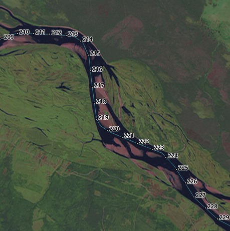

generate milestones for single line in geojson file, using PostGIS. 
input: 	  source.json
output:	  route.gpx with route for garmin
	        View public.milestones in PostGIS database with points 
	
	
Скрипт для генерации километровых отметок на линии в PostGIS. Создаёт точки через каждый километр.	
	

